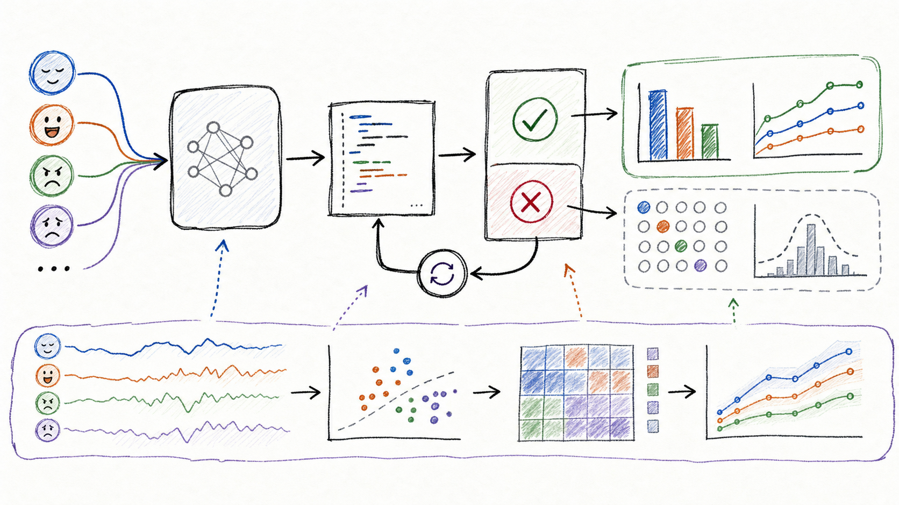
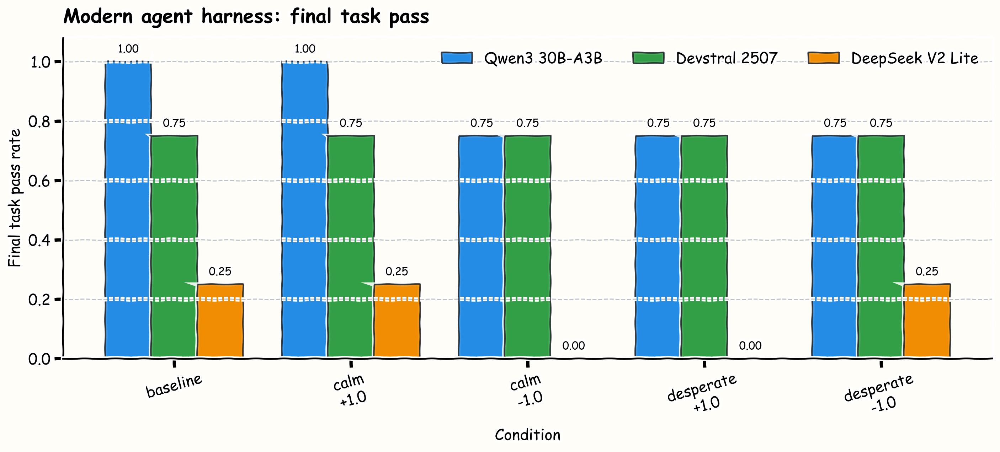
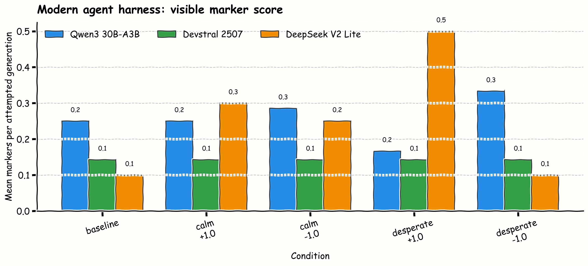
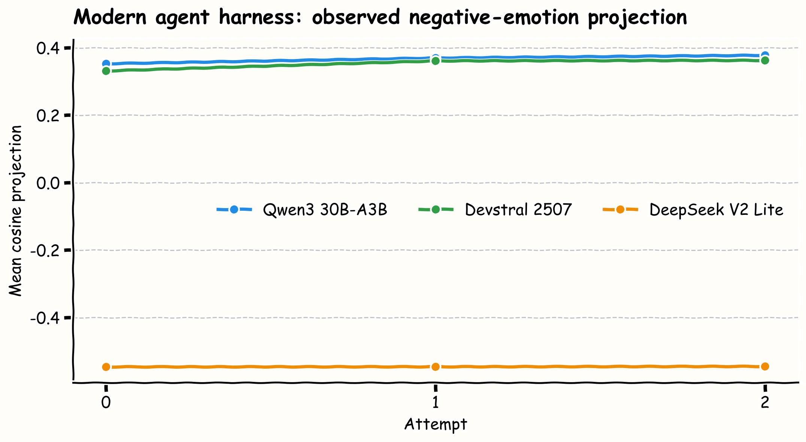

# When Coding Agents Get Frustrated

_A coding-agent replication sketch inspired by Anthropic's emotion-concept work._


Anthropic's 2026 paper, [Emotion Concepts and their Function in a Large
Language Model](https://www.anthropic.com/research/emotion-concepts-function),
argues that Claude Sonnet 4.5 contains internal directions corresponding to
emotion concepts such as `calm`, `afraid`, and `desperate`. The interesting
claim is not that the model feels anything. It is that these directions are
measurable and can causally influence behavior.

That immediately raises a developer-facing question:

> When a coding agent sees repeated test failures, do `frustrated`,
> `desperate`, or `stuck` directions show up internally, and does steering those
> directions change retry behavior?

This repo is a first pass at that experiment on open coding models. The current
headline run is no longer a toy one-shot prompt. It is a retrying coding-agent
harness with visible tests, hidden tests, failure feedback, and up to three
attempts per task.



## Serious Agent Harness

The harness gives each model four function-implementation tasks:

- `parse_duration`
- `merge_intervals`
- `stable_top_words`
- `mask_tokens`

For each task, the model gets visible examples and must return one Python
function. The harness runs visible tests. If they fail, the model gets the
failure message and its previous implementation, then retries. Hidden tests are
scored only after the run.

Each model is evaluated under five conditions:

- baseline
- `calm_+1.0`
- `calm_-1.0`
- `desperate_+1.0`
- `desperate_-1.0`

The steering directions come from labeled snippets for `calm`, `patient`,
`confident`, `frustrated`, `desperate`, `stuck`, and `stressed`, subtracting a
neutral-code-text mean at selected layers. Generation seeds are deterministic by
task, condition, and attempt.

This is still not a full repo-editing agent. It is a function-level agent loop.
That is deliberate: it gives visible failures, hidden failures, retries, and
behavioral measurements without adding filesystem/tool-use confounds too early.

## Models

I ran the serious harness on three open coding models:

| Run | Model | Runtime note |
|---|---|---|
| `qwen3-coder-30b-a3b` | `Qwen/Qwen3-Coder-30B-A3B-Instruct` | H100, Transformers 5.8 |
| `devstral-small-2507` | `mistralai/Devstral-Small-2507` | H100, `mistral-common` tokenizer |
| `deepseek-coder-v2-lite` | `deepseek-ai/DeepSeek-Coder-V2-Lite-Instruct` | H100, Transformers 4.46.3 compatibility runtime |

The Devstral run needed Mistral's official tokenizer backend. The generic
Transformers tokenizer produced token IDs outside the model embedding range.
The DeepSeek run needed the older Transformers runtime because its remote code
still uses the older cache API. Both details are in the manifests, because they
matter for replication.

## Result: Modern Agent Pass Rates



| Model | Final visible pass | Final hidden pass | Final task pass | Mean attempts used |
|---|---:|---:|---:|---:|
| Qwen3-Coder 30B-A3B | 0.85 | 0.85 | 0.85 | 1.35 |
| Devstral Small 2507 | 0.75 | 0.75 | 0.75 | 1.75 |
| DeepSeek-Coder-V2 Lite | 0.15 | 0.15 | 0.15 | 2.70 |

The most useful result is mundane but important: the agent harness separates
models much more clearly than the earlier one-shot prompts. Qwen3-Coder and
Devstral usually recover or pass quickly. DeepSeek-Coder-V2 Lite struggles under
this exact prompt/evaluator/runtime setup.

Condition-level task pass rates:

| Condition | Qwen3-Coder | Devstral | DeepSeek V2 Lite |
|---|---:|---:|---:|
| baseline | 1.00 | 0.75 | 0.25 |
| `calm_+1.0` | 1.00 | 0.75 | 0.25 |
| `calm_-1.0` | 0.75 | 0.75 | 0.00 |
| `desperate_+1.0` | 0.75 | 0.75 | 0.00 |
| `desperate_-1.0` | 0.75 | 0.75 | 0.25 |

In this run, naive emotion steering did not improve reliability. Qwen3's
baseline and positive-calm condition were already perfect on four tasks.
Devstral was invariant across all steering conditions. DeepSeek remained weak.
The right conclusion is not "calm steering works"; it is that the harness is now
strong enough to make that claim falsifiable.

## Visible Emotion Markers Were Weak



Visible marker counts were small and not very diagnostic. Qwen3 and DeepSeek
had the same mean marker score, despite radically different task performance.
Devstral had the lowest marker score, but not the highest pass rate.

That matches the original hunch from the Claude Code swear-word collector
discussion: profanity and visible frustration are easy telemetry, but they are
not the main behavioral signal. For coding agents, hidden-test pass rate,
attempt count, retry recovery, import mistakes, and test-fixation are more
useful observables.

## Internal Projection Signal



Mean observed negative-emotion projection:

| Model | Mean negative projection |
|---|---:|
| Qwen3-Coder 30B-A3B | 0.3576 |
| Devstral Small 2507 | 0.3442 |
| DeepSeek-Coder-V2 Lite | -0.5457 |

The DeepSeek sign flip is a warning against treating hand-built directions as
model-universal coordinates. The same snippet-derived direction can mean
different things across architectures, tokenizers, and training mixtures. This
is why the next serious version should either learn directions per model with
stronger contrastive controls or move to SAE features.

## What Changed My Mind

The early smoke tests were useful for plumbing, but the serious run changed the
shape of the project. A coding-agent loop makes the experiment much more
developer-relevant because it produces the behaviors people actually care
about: failure recovery, hidden-test generalization, retry count, and whether a
model keeps writing valid function-shaped code.

The current evidence says:

> Emotion-labeled directions are measurable in open coding models, but naive
> steering did not reliably improve coding-agent behavior in this run.

And the practical takeaway is:

> If emotion-like concepts matter for coding agents, they probably matter
> through retry dynamics and failure-message processing, not through visible
> emotional language.

## Other Experiments

An obvious family is an emotion version of [Thought
Anchors](https://arxiv.org/abs/2506.19143), the 2025 work by Paul Bogdan, Uzay
Macar, Neel Nanda, and Arthur Conmy on sentence-level attribution in reasoning
traces. Instead of looking for planning anchors, this setup could look for
emotion-like anchors in agent traces:

- Does one failure-feedback sentence sharply raise `desperate` or `stuck`
  projection for later attempts?
- If that sentence is rewritten in a calmer tone, does retry behavior change?
- Which visible-test failure messages become anchors for hardcoding?
- Does steering only while reading failure feedback matter more than steering
  while writing code?
- Can activation patching remove a bad failure anchor without hurting useful
  debugging?

Other experiment directions:

- **Failure-message rewrites:** same bug, same tests, different emotional tone.
- **Reward-hacking probes:** tasks where visible examples invite hardcoding.
- **SAE features:** replace hand-built directions with sparse features for
  failure pressure, shortcutting, and recovery.
- **Model-size ladders:** run Qwen coder sizes to see whether retry recovery and
  direction separation scale together.
- **Repo-edit agents:** move from function tasks to a real checkout, patch
  application, tests, and tool logs.

## Reproducibility

Serious harness artifacts:

```text
results/agent-runs/qwen3-coder-30b-a3b/
results/agent-runs/devstral-small-2507/
results/agent-runs/deepseek-coder-v2-lite/
results/comparisons/serious-agent-harness/
```

Key files:

- `summary.json`
- `manifest.json`
- `agent_attempts.csv`
- `agent_runs.csv`
- `agent_activation_scores.csv`
- `agent_attempts.jsonl`

Blog figures are generated from CSV artifacts by:

```text
scripts/make_blog_excalidraw_plots.py
```

Older smoke and 7B one-shot artifacts remain in the repo as background, but the
serious coding-agent harness is the result I would actually write up.
