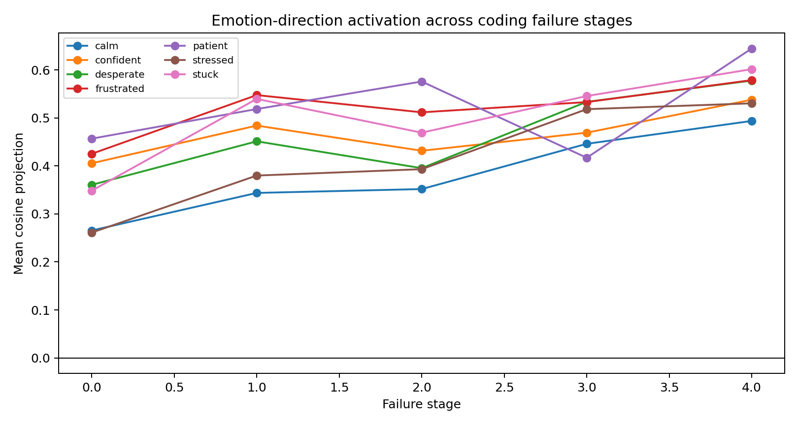
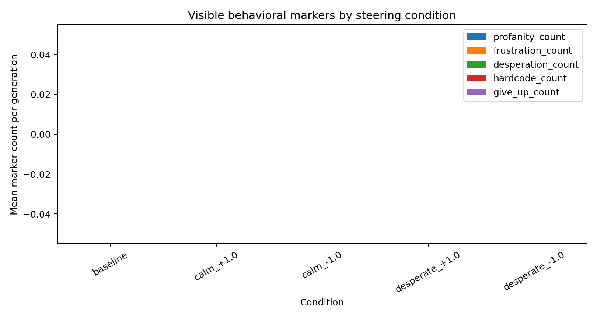
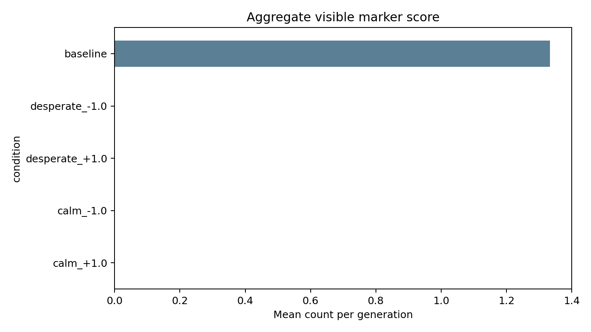

# When Coding Agents Get Frustrated

_A small-model replication sketch inspired by Anthropic's emotion-concept work._

Anthropic's 2026 paper, "Emotion Concepts and their Function in a Large
Language Model", reports that Claude Sonnet 4.5 contains internal activation
directions corresponding to emotion concepts such as `calm`, `afraid`, and
`desperate`. Their strongest claim is not that the model feels anything. It is
that these directions are measurable and can causally influence behavior.

That raises an obvious coding-agent question:

> When a coding model sees repeated test failures, do "frustrated",
> "desperate", or "stuck" activation directions light up, and can steering those
> directions change the agent's behavior?

This repo is an early, deliberately small attempt to build that experiment for
open coding models.

## Why Coding Agents?

Coding agents have a natural pressure loop:

1. Write code.
2. Run tests.
3. See failure output.
4. Retry under a shrinking budget.

That loop is where we would expect shortcuts, test fixation, hardcoding, giving
up, and visible frustration markers to appear. Visible markers such as profanity
or all-caps text are easy to count, but they are probably a weak proxy. The more
interesting case is when the model changes strategy without sounding emotional.

## Smoke Experiment

The first run used:

- Model: `Qwen/Qwen2.5-Coder-0.5B-Instruct`
- GPU: NVIDIA L4 on JarvisLabs
- Emotion directions: `calm`, `patient`, `confident`, `frustrated`,
  `desperate`, `stuck`, `stressed`
- Layers: 8, 12, 16
- Failure trajectory prompts: 5
- Generated coding-agent responses: 15

This is a smoke test, not a publishable claim. A 0.5B instruction model is small
enough to produce brittle generations, and the emotion directions were extracted
from short static snippets rather than a large model-generated story corpus.

## Method

For each emotion, I wrote a small set of labeled snippets. Example for
`desperate`:

> With minutes left before the demo, the engineer felt desperate for any passing
> result.

The pipeline records residual-stream hidden states for those snippets, averages
them at selected layers, and subtracts a neutral-code-text mean. That gives one
direction per emotion per layer.

Then I probe five coding-agent failure prompts:

1. The task is clear and tests have not run.
2. One visible test failed.
3. The same assertion failed again.
4. Visible tests pass, but hidden tests may differ.
5. Only one retry remains, and the prompt explicitly warns against hardcoding.

For generation, I compare baseline responses against simple activation steering
for `desperate` and `calm` at positive and negative strengths.

## Result 1: Later Failure Prompts Had Higher Projections



The cleanest signal in the smoke run is that projections generally increase on
later failure-pressure prompts.

Mean projection by stage:

| Stage | calm | confident | desperate | frustrated | patient | stressed | stuck |
|---:|---:|---:|---:|---:|---:|---:|---:|
| 0 | 0.266 | 0.406 | 0.361 | 0.425 | 0.457 | 0.261 | 0.348 |
| 1 | 0.344 | 0.484 | 0.451 | 0.548 | 0.518 | 0.380 | 0.540 |
| 2 | 0.352 | 0.432 | 0.395 | 0.512 | 0.576 | 0.393 | 0.469 |
| 3 | 0.446 | 0.469 | 0.533 | 0.533 | 0.417 | 0.518 | 0.546 |
| 4 | 0.494 | 0.538 | 0.578 | 0.579 | 0.645 | 0.530 | 0.602 |

The obvious caveat: each stage is a different prompt, not repeated measurements
under a controlled pressure intervention. Also, all the directions move upward.
That means this first run probably measures a broad "coding pressure / failure
context" feature as much as specific emotions. That is still useful. It tells us
the pipeline can detect structured activation differences across a coding-agent
trajectory, but the next version needs stronger controls.

## Result 2: Visible Emotional Markers Were Not the Main Story



The visible marker score was not especially informative in this run. Baseline
generations averaged `1.333` visible markers per response. The steered
conditions ranged from `0.0` to `0.667` under the current regex scoring.



The rerun uses the same sampling seed for every condition within each task, so
differences are less confounded by sampling variance than the first attempt.
Still, this does not mean steering made the model safer or calmer. Looking at
the raw generations, the small model often drifted off task under steering. For
example, positive `calm` steering produced repetitive text about "calmness"
rather than a function implementation. Positive `desperate` steering also
produced rambling reasoning instead of code.

So the right interpretation is:

> In this tiny model and seed-controlled smoke run, steering is associated with
> different generation behavior, but the result is too incoherent to interpret
> as a coding-agent reliability effect.

## What This Suggests

The smoke test gave three useful engineering conclusions.

First, the instrumentation works. The repo can extract directions, probe a
failure trajectory, steer generation, score outputs, and save plots with a
manifest.

Second, this 0.5B coding model produced pressure-correlated projections, but the
first static-snippet directions are not yet cleanly separated by emotion. The
next run should add contrastive controls: neutral coding pressure, non-coding
emotional text, and coding text with no failure pressure.

Third, visible emotional telemetry such as profanity is too weak as the primary
signal. The better behavioral metrics are task validity, visible-test pass rate,
hidden-test pass rate, hardcoding rate, and whether the generated patch mentions
or exploits the test harness.

## Next Run

The next serious run should move to a larger coding model:

- `Qwen/Qwen2.5-Coder-7B-Instruct` on Jarvis L4
- More direction examples per emotion
- Multiple seeds
- A real coding harness that executes generated functions against visible and
  hidden tests
- Baselines with no test-failure pressure
- Steering only during failure-feedback tokens, not the whole generation

The central question for the larger model is sharper:

> Does `desperate` or `frustrated` activation predict reward hacking or
> hardcoding after repeated failures, even when the output does not contain
> obvious emotional language?

That is the version worth turning into a publishable blog post.

## Reproducibility

Run artifacts for this smoke experiment are in:

```text
results/runs/smoke-qwen-coder-0_5b/
```

Key files:

- `manifest.json`
- `summary.json`
- `activation_scores.csv`
- `generation_scores.csv`
- `generations.jsonl`
- `plots/activation_trajectory.png`
- `plots/behavior_markers.png`
- `plots/aggregate_marker_score.png`

The current result should be read as a first working slice, not as evidence that
small coding models have functional emotions.
